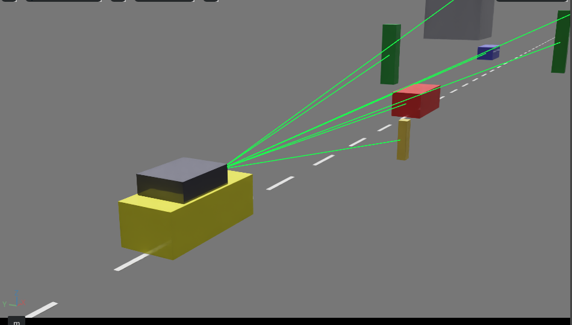

# Car Digital Twin — Isaac Sim

Software-in-the-loop digital twin of a car. The vehicle and all its sensors live
inside NVIDIA Omniverse: a rig drives through a labelled scene and reports what
it sees — **class + range per object** ("car at 21 m, tree at 34 m") — as the
foundation for a Tesla-style perception stack.



*Yellow ego car driving; green rays are live detections to each object — red and
blue cars, trees, a pedestrian, a building. Every ray is one row of the console
readout.*

**Status: working.** Isaac Sim 5.1.0, perception validated against ground truth.

---

## Run it in 3 commands

**Have an RTX GPU?** → [LOCAL.md](LOCAL.md) — native window, no cloud needed.

```bash
python3.11 -m venv ~/isaac-venv
~/isaac-venv/bin/pip install "isaacsim[all,extscache]==5.1.0" --extra-index-url https://pypi.nvidia.com
~/isaac-venv/bin/python pod/drive_demo.py
```

**No GPU?** → [SETUP.md](SETUP.md) — rent one on RunPod (~$0.35/hr for a 4090).

**Restarting a stopped pod?** `/workspace` survives, so the install does too:

```bash
VNC_PASSWORD='something' bash <(curl -fsSL https://raw.githubusercontent.com/Anudeepreddynarala/car-digital-twin/main/pod/bootstrap.sh)
```

No NGC account or API key required. `pypi.nvidia.com` is unauthenticated.

## Requirements

An **RTX GPU with RT cores**. A100, H100 and H200 do **not** work — they are
compute-only and unsupported by the Omniverse RTX renderer, despite being the
most expensive options on any cloud menu. RTX 4080/4090, A6000, A40 and L40S are
all fine.

Python **exactly 3.11**, driver 580.65.06+, ~40 GB disk.

## What the demos do

| Script | What it does |
|---|---|
| `pod/drive_demo.py` | **Visible.** Car drives, chase camera follows, detection rays drawn live in the viewport |
| `pod/perception_demo.py` | **Headless.** Prints class + range per object each step. Much faster |

Both build their own scene — no asset downloads needed.

Validated against ground truth: with a car placed at x=10 m, a sensor at x=2 m
reports **8.0 m**; at x=6 m → **4.1 m**; at x=10 m → **0.9 m**; the object drops
out once passed.

## What sensors is this actually using?

**Right now: a camera plus the simulator's ground truth — not radar, not LiDAR.**
Detections come from Replicator's `bounding_box_3d` annotator, which hands over
each object's class and world position directly. That is *perfect* perception,
i.e. cheating.

This is deliberate. It builds the visualisation and gives you a **reference to
score real sensors against** — something you cannot get on a real vehicle without
survey-grade equipment. Real RTX radar and LiDAR come next, measured against it.

You can already see why multiple sensors matter: the camera's ~47° FOV means an
object more than ~23.5° off-axis is invisible. Watch the pedestrian in the demo —
undetected until the car is nearly alongside. In a real car that is someone
stepping off the kerb.

## Roadmap

- [x] Isaac Sim running, GUI, GPU verified
- [x] Range + class per object, validated
- [x] Visible driving demo with detection rays
- [ ] RTX radar + stereo cameras, scored against ground truth
- [ ] YOLO on the camera feed (PyTorch 2.7 ships with the install)
- [ ] Traffic signs / signals / lanes — **blocked on road content**

### The one structural risk

Isaac Sim ships **no drivable road content** — its environments are warehouses,
kitchens and hospital corridors. Signs, signals and lane markings need a scene
that contains them. Options: hand-build a test road; buy third-party SimReady
assets; import OpenDRIVE (community, unofficial); or run **CARLA** for scenario
content and keep Isaac for sensor fidelity.

CARLA is free (MIT; assets CC-BY) and is *easier* to host in the cloud than Isaac,
since its protocol is plain TCP. The tradeoff is fidelity: CARLA's radar is
explicitly a non-raytraced placeholder and its LiDAR is plain ray-casting, where
Isaac's RTX sensors are physically based.

## Four things that will waste your day

1. **`no suitable CUDA GPU` means the Vulkan *loader* is missing**, not the driver.
   `apt-get install libvulkan1`. Do not add a second ICD — the NVIDIA one already
   exists at `/etc/vulkan/icd.d/`, and two makes Kit refuse to start.
2. **`rep.orchestrator.step()` drives captures.** `world.step(render=True)`
   advances the sim but never triggers the annotator, so `get_data()` returns
   empty *and the process still exits 0*. Assert on content, not exit code.
3. **`/OmniverseKit_Persp` is not a prim.** `GetPrimAtPath` returns invalid and
   your camera code silently no-ops, leaving a blank viewport over a perfectly
   correct scene. Make your own camera and set `get_active_viewport().camera_path`.
4. **RunPod pods cannot build Docker images** — no daemon inside. Install with
   pip, or build off-pod and deploy from the image.

## Docs

| File | For |
|---|---|
| [ARCHITECTURE.md](ARCHITECTURE.md) | How it works: OpenUSD, the sensor chain, and what is *not* real yet |
| [LOCAL.md](LOCAL.md) | Running on your own desktop (Linux / Windows) |
| [SETUP.md](SETUP.md) | Cloud setup on RunPod, and why each constraint exists |
| [TEAM.md](TEAM.md) | Onboarding checklist + gotchas ranked by time lost |

## Licence

Scripts here are MIT. Isaac Sim itself is under NVIDIA's licence — the installer
prompts for EULA acceptance (`OMNI_KIT_ACCEPT_EULA=YES` for non-interactive runs).
